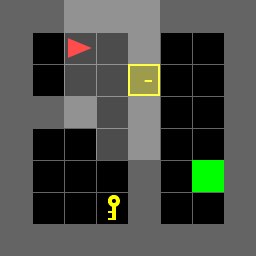
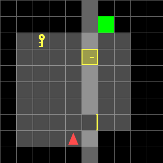

# Cost-Optimal Door-Key Navigation

A discrete-state planning system that computes minimum-cost MiniGrid trajectories for seven known layouts and one reusable state-feedback policy for an exhaustive family of 36 parameterized 10x10 environments.

## Animated results

### Fixed layouts: knowing when interaction matters

<table>
  <tr>
    <td width="50%" align="center">
      
    </td>
    <td width="50%" align="center">
      
    </td>
  </tr>
  <tr>
    <td align="center">
      <sub><strong>Key and door required - cost 54, 21 actions.</strong><br/>The agent makes a long detour to collect the key, returns to the partition, unlocks the door, and then reaches the goal.</sub>
    </td>
    <td align="center">
      <sub><strong>Irrelevant subgoals ignored - cost 17, 7 actions.</strong><br/>Because the goal is already reachable, the planner correctly avoids the key and locked door instead of following a hard-coded interaction sequence.</sub>
    </td>
  </tr>
</table>

### One policy, different door states

<table>
  <tr>
    <td width="50%" align="center">
      
    </td>
    <td width="50%" align="center">
      
    </td>
  </tr>
  <tr>
    <td align="center">
      <sub><strong>Lower passage open - cost 29, 11 actions.</strong><br/>With the upper door locked and lower door open, the policy bypasses the key and crosses through the available passage.</sub>
    </td>
    <td align="center">
      <sub><strong>Both passages locked - cost 50, 19 actions.</strong><br/>For the same key and goal locations, closing the lower door changes the optimal strategy: retrieve the key, unlock the upper door, then cross.</sub>
    </td>
  </tr>
</table>

> **Visualization note:** MiniGrid renders only the agent's current view, so black cells are outside the visible region in that frame. The planner itself uses the complete loaded map state; this is a planning system, not a learned perception policy. All repository GIFs loop continuously at the intended 0.8-second frame cadence.

| Verified goal-reaching rollouts | Random-family policy entries | Scenario-specific result sets |
| :---: | :---: | :---: |
| **43 / 43** | **26,208** | **43 GIFs + 43 trajectory plots** |

## Overview

The task is to move a simulated robot to a goal while accounting for walls, orientation, keys, and locked doors. The objective is not simply to minimize the number of actions: each action has a different positive cost, so the planner must trade cheap rotations against forward motion and object interactions.

The implementation models the environment as a deterministic weighted shortest-path Markov decision process. It uses an augmented state to remember task progress, an exact cost-aware planner for known maps, and a precomputed feedback table that covers every supplied key, goal, and two-door configuration in the random-map family.

📄 **[Read the full technical report](/docs/ece276b_hw1_report.pdf)** - MDP formulation, Bellman optimality equations, all 43 annotated trajectories, and a discussion of limitations.

## Key Contribution

- A MiniGrid transition model for turning, collision-aware forward motion, front-cell key pickup, and locked-door interaction.
- A forward Dijkstra planner that returns a minimum-cost action sequence for each fully known layout.
- A unified random-family policy built with multi-source reverse Dijkstra from every terminal state, then cached for direct dictionary lookup during rollout.
- An evaluation and visualization pipeline that replays plans in MiniGrid and produces both looping GIFs and annotated 1400x1400 trajectory figures.
- Deterministic environment assets for seven assessed known maps and all 36 combinations of three key positions, three goal positions, and four two-door states.

## Technical approach

### State and objective

For a known map, the planner represents the state as

```math
s = \left(p_x, p_y, d, k, \mathbf{o}\right),
```

where:

- $(p_x, p_y) \in \{0, \dots, W-1\} \times \{0, \dots, H-1\}$ is the agent position.
- $d \in \{0,1,2,3\}$ represents the agent orientation: right, down, left, and up, respectively.
- $k \in \{0,1\}$ indicates whether the agent is carrying the key.
- $\mathbf{o} = (o_1, \dots, o_D) \in \{0,1\}^{D}$ is the door-state tuple, where $o_i = 1$ indicates that door $i$ is open and $o_i = 0$ indicates that it is closed.

For the $10 \times 10$ random-map family, the policy key also includes the configuration variables:

```math
s =
\left(
x_{\mathrm{agent}},
y_{\mathrm{agent}},
\theta,
\texttt{has\_key},
\texttt{key\_position},
\texttt{goal\_position},
\texttt{door\_open\_tuple}
\right).
```


This distinction is what makes a single feedback table valid across all 36 files: key position, goal position, and both door states are part of the state on which the action depends.

The five controls use the non-uniform stage costs defined by the project:

| Control | Meaning | Cost |
|---|---|---:|
| `TL`, `TR` | Turn left or right | 1 |
| `PK` | Pick up the key in the front cell | 2 |
| `MF` | Move forward one traversable cell | 3 |
| `UD` | Unlock the door in the front cell | 5 |

The cost-to-go obeys the Bellman relation `V*(s) = min_a [c(a) + V*(f(s, a))]`, with zero cost at goal states. Because every action cost is positive, the implementation solves this relation exactly with priority-queue shortest-path algorithms rather than synchronous value-iteration sweeps.

### Known-map planning

The planner scans the loaded grid, records walls, keys, goals, and an arbitrary tuple of door states, and initializes the robot pose from the environment. Forward Dijkstra then expands the five actions from the supplied start state. Parent pointers reconstruct the minimum-cost action sequence as soon as a goal state is settled.

This formulation captures why the two fixed-map demos above differ: object interaction is selected only when it lowers the cost of reaching the goal under that map's geometry.

### Unified random-family policy

The random family fixes a vertical barrier at `x = 5`, doors at `(5, 3)` and `(5, 7)`, and the start pose at `(4, 8)` facing up. The remaining variables form the complete test family:

```text
3 key positions x 3 goal positions x 4 door-state combinations = 36 maps
```

For each of the nine key/goal configurations, the implementation enumerates:

```text
92 traversable cells x 4 headings x 2 key states x 4 door states
= 2,944 states per configuration
= 26,496 value states across the family
```

It constructs the reverse transition graph and runs multi-source Dijkstra from all goal states. The resulting table contains 26,208 nonterminal state-action decisions; the other 288 states are terminal. Evaluation performs no per-file replanning - it rolls out this cached table with a 200-action guard against unexpected loops.

### System pipeline

<p align="center">
  
</p>

## Results

I replayed every returned sequence through the repository's MiniGrid action adapter. All 43 cases terminated at the goal, and the planner's computed cost matched the simulator replay cost in every case.

| Evaluation set | Goal reached | Cost range | Action range | Mean cost | Mean actions |
|---|---:|---:|---:|---:|---:|
| 7 known maps | 7 / 7 | 13-54 | 5-21 | 25.57 | 10.57 |
| 36 random maps, one policy | 36 / 36 | 14-53 | 6-20 | 30.17 | 11.47 |

Across matched key/goal configurations in the random family, the mean optimal cost rises from **22.67** when both doors are open to **46.33** when both are locked. The increase reflects the required key-retrieval detour and unlock action rather than a change in the optimization objective.

<details>
<summary><strong>Per-map results for the seven known layouts</strong></summary>

| Environment | Cost | Actions |
|---|---:|---:|
| `doorkey-5x5-normal` | 28 | 13 |
| `doorkey-6x6-normal` | 33 | 14 |
| `doorkey-8x8-normal` | 54 | 21 |
| `doorkey-6x6-direct` | 13 | 5 |
| `doorkey-8x8-direct` | 17 | 7 |
| `doorkey-6x6-shortcut` | 15 | 6 |
| `doorkey-8x8-shortcut` | 19 | 8 |

</details>

The complete evidence set is available in [`submitted/gif/`](submitted/gif/) and [`submitted/figures/`](submitted/figures/). Each of the 43 solved scenarios has a full animation and a static plot labeled with the path, action indices, total cost, and action count.

## Engineering highlights

- **Exact weighted planning:** positive, non-uniform costs are handled directly rather than approximated by action count.
- **Task-aware state design:** pose alone is insufficient; key possession and individual door states preserve the Markov property needed for correct decisions.
- **Reusable policy construction:** reverse dynamic programming moves work offline so random-map execution becomes a dictionary lookup at each state.
- **Reproducible evaluation:** all assessed environments and complete visual result artifacts are versioned with the implementation.
- **Failure containment:** unsupported states raise explicit errors, and policy rollout has a bounded-step guard instead of failing silently.

## Running the project

The portfolio results live in the final [`submitted/`](submitted/) package. With Python 3.8-3.12:

```bash
cd submitted
python -m pip install -r requirements.txt
python doorkey.py
python trajectory_visualization.py
```

`doorkey.py` prints the policy-table size and every environment's cost, action count, and action sequence while regenerating the GIFs. `trajectory_visualization.py` regenerates the annotated PNG figures.

**Core stack:** Python, NumPy, Gymnasium, MiniGrid, Matplotlib, ImageIO, and standard-library priority queues.

## Limitations and next steps

- The current system is simulation-only and plans from the full serialized grid; it does not solve perception, localization, or partial observability.
- Dynamics are deterministic and the unified policy assumes the repository's fixed 10x10 barrier and door geometry.
- Explicit enumeration grows quickly as maps, objects, and door states are added. Reachability pruning, symbolic state compression, or heuristic search would extend the approach to larger task spaces.
- A natural next step is to add stochastic transitions and online state estimation, then evaluate the planner in a partially observed or physical robot setting.

---

Developed for UC San Diego ECE 276B: Planning and Learning in Robotics. The implementation and results are presented here as a discrete planning and robotics engineering portfolio project.
