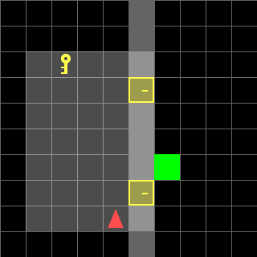
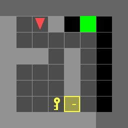
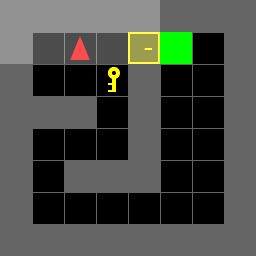
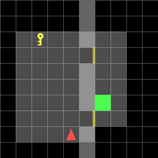
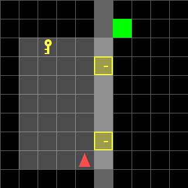

# Optimal Door-Key Navigation via Dynamic Programming

**A dynamic-programming planner that computes provably optimal action sequences in MiniGrid Door-Key worlds — including a single precomputed control policy that solves all 36 maps of a random environment family with zero online replanning.**

<table>
  <tr>
    <td align="center"></td>
    <td align="center"></td>
  </tr>
  <tr>
    <td align="center"><sub><b>Known-map planning (8×8 normal).</b> The planner computes the cost-optimal 21-action sequence: navigate to the key, pick it up, unlock the door, and reach the goal (total cost 54).</sub></td>
    <td align="center"><sub><b>One policy for 36 random maps (hardest case).</b> The same precomputed policy — a pure table lookup at runtime — fetches a distant key, unlocks a locked door, and reaches the goal (total cost 53, 20 actions).</sub></td>
  </tr>
</table>

**[📄 Read the full technical report](ece276b_hw1_report.pdf)** · [Project specification](ECE276_PR1.pdf)

## Overview

An agent in a MiniGrid Door-Key world must reach a goal cell in a map containing walls, locked doors, and a key — while minimizing a **non-uniform action cost** (turning is cheap, moving is expensive, unlocking is very expensive). The task couples continuous-style navigation with discrete object interaction: the optimal route may require detouring to a key, unlocking a door, or ignoring both entirely.

The problem is formulated as a **deterministic shortest-path Markov Decision Process** over an augmented state that captures the agent pose, key possession, and door status, and solved exactly with dynamic programming:

- **Part A — known maps:** an exact DP shortest-path solver (Dijkstra-style label correcting with early goal termination) computes the optimal action sequence for each of 7 known environments of varying size and topology.
- **Part B — random map family:** a **single unified control policy** π(x) is precomputed offline by backward dynamic programming from all goal states. Because the policy state includes the map parameters (key position, goal position, door states), the *same* 26,208-entry table optimally controls every one of the 36 random 10×10 environments — no per-map planning, no replanning at execution time.

Both solvers share one deterministic transition model, and every trajectory is verified by rolling the plan out in the actual MiniGrid simulator and rendering it as an animated GIF.

## Problem formulation

The state augments the agent pose with the interaction status of the world:

```math
x = (p_x,\ p_y,\ d,\ k,\ o)
```

where $`(p_x, p_y)`$ is the agent position, $`d \in \{0,1,2,3\}`$ its heading, $`k \in \{0,1\}`$ key possession, and $`o`$ the door-open status (one bit per door). The control space is $`\mathcal{U} = \{\text{MF}, \text{TL}, \text{TR}, \text{PK}, \text{UD}\}`$ with stage costs

| Action | MF (move forward) | TL / TR (turn) | PK (pick up key) | UD (unlock door) |
|---|:-:|:-:|:-:|:-:|
| Cost | 3 | 1 | 2 | 5 |

The planner minimizes the accumulated stage cost until the goal is reached, i.e. it solves the Bellman optimality equation over the finite state space:

```math
V^{*}(x) = \min_{u \in \mathcal{U}} \big[\, \ell(x, u) + V^{*}(f(x, u)) \,\big], \qquad \pi^{*}(x) = \arg\min_{u \in \mathcal{U}} \big[\, \ell(x, u) + V^{*}(f(x, u)) \,\big]
```

Because turning costs 1 while moving costs 3 and unlocking costs 5, minimizing cost is *not* the same as minimizing steps — the planner must genuinely trade off detours, key pickups, and door unlocks.

## Cost-aware behavior: minimizing total cost, not step count

The non-uniform cost model produces qualitatively different optimal strategies across map variants — all emerging from the same planner with no hand-coded rules:

<table>
  <tr>
    <td align="center"></td>
    <td align="center"></td>
  </tr>
  <tr>
    <td align="center"><sub><b>8×8 direct:</b> the door is already open, so the planner ignores the key completely and walks straight to the goal — 7 actions with no pickup or unlock (cost 17).</sub></td>
    <td align="center"><sub><b>8×8 shortcut:</b> the key sits next to the start, so paying for pickup (2) plus unlock (5) beats the long detour — an 8-action solution (cost 19).</sub></td>
  </tr>
</table>

## Key contributions

- **Exact DP planner for arbitrary known maps.** A generic environment scanner extracts walls, keys, doors, and goals directly from any loaded MiniGrid world, and a map-agnostic transition function supports any number of doors — the same solver handles all 7 known environments (5×5 to 8×8, normal/direct/shortcut variants) with zero per-map code.
- **A true single policy for an entire environment family.** Part B requires one control policy for all 36 random maps. Rather than replanning per map, the policy state is augmented with the map parameters (3 key positions × 3 goal positions × 2 door states each), and backward DP from all goal states on the reverse transition graph yields exact optimal cost-to-go and a 26,208-state policy table covering the entire family. Runtime control is a pure table lookup.
- **Fast offline construction.** The full family-wide policy builds in ~0.2 s; each known map solves in milliseconds thanks to priority-queue label correcting with early goal termination.
- **End-to-end verification and visualization tooling.** Every computed plan is rolled out in the real MiniGrid simulator; automated tooling renders 43 animated GIFs and 43 annotated static trajectory figures (cost, step count, and action sequence in each title) used directly in the report.
- **Reproducible evaluation.** Environment instances are stored as serialized files, dependencies are pinned, and a single command re-runs the complete 43-environment evaluation.

## Technical approach

**Deterministic shortest-path DP (Part A).** Each known map is solved by forward dynamic programming on the augmented state graph, implemented as Dijkstra-style label correcting with a binary heap: states are expanded in order of optimal cost-to-arrive, and search terminates the moment a goal state is popped. Parent pointers recover the optimal action sequence. Since all stage costs are strictly positive and the state space is finite, the returned sequence is globally optimal.

**Family-wide policy via backward DP (Part B).** The 36 random maps share a fixed layout (10×10 grid, a wall at column 5 with doors at (5,3) and (5,7)) and vary only in key position, goal position, and initial door states. The policy state is therefore defined as

```math
x = \left(p_x,\ p_y,\ d,\ k,\ p^{\text{key}},\ p^{\text{goal}},\ o_1,\ o_2\right)
```

For each of the 9 (key, goal) configurations, all states are enumerated, the transition graph is **reversed**, and a multi-source Dijkstra pass from every goal state computes the exact optimal cost-to-go $`V^{*}(x)`$ and greedy action $`\pi^{*}(x)`$ for every reachable state at once. The union over configurations is one policy table that optimally controls any environment in the family — including maps where a door is already open or where ignoring the key is cheaper.

**Solver dispatch.** At load time the planner inspects the environment; if the layout matches the random-map family signature it executes the precomputed policy, otherwise it falls back to the general known-map solver. The two paths share the same transition semantics, so behavior is consistent across regimes.

**Design decisions.**
- *Backward instead of forward DP for Part B:* one backward pass per configuration prices *all* start states simultaneously — exactly what a state-feedback policy requires — whereas forward search would only price a single start.
- *Blocking transitions instead of state pruning:* invalid moves (into walls, closed doors, or the uncollected key cell) map a state to itself, which keeps the transition function total and the DP recursion simple.
- *Policy caching:* the family policy is built once per process and memoized, so evaluating 36 environments amortizes a single 0.2 s construction.

## Results

All 43 environments are solved optimally. Full per-environment costs, step counts, and action sequences are printed by `doorkey.py` and visualized in [figures](starter_code/figures/) and [GIFs](starter_code/gif/).

**Part A — known maps** (one optimal sequence per map):

| Environment | Optimal cost | Actions | Optimal sequence |
|---|:-:|:-:|---|
| doorkey-5x5-normal | 28 | 13 | TL TL MF TR PK TR MF TL UD MF MF TR MF |
| doorkey-6x6-normal | 33 | 14 | MF TL MF PK TL TL MF TR MF UD MF MF TR MF |
| doorkey-8x8-normal | 54 | 21 | MF TR MF MF MF MF PK TL TL MF MF MF TR UD MF MF MF TR MF MF MF |
| doorkey-6x6-direct | 13 | 5 | MF MF TR MF MF |
| doorkey-8x8-direct | 17 | 7 | MF TL MF MF MF TL MF |
| doorkey-6x6-shortcut | 15 | 6 | PK TL TL UD MF MF |
| doorkey-8x8-shortcut | 19 | 8 | TR MF TR PK TL UD MF MF |

**Part B — random 10×10 family, single policy:**

- **36 / 36 environments solved** by the same 26,208-state policy table with no per-map planning.
- Trajectory costs range from **14** (door already open, direct route) to **53** (locked doors, distant key), mean cost ≈ 30.2.
- Policy construction: **~0.2 s** for the entire family; execution is a table lookup per step.

<table>
  <tr>
    <td align="center"></td>
    <td align="center"></td>
  </tr>
  <tr>
    <td align="center"><sub><b>Easy family member:</b> both doors start open, so the policy drives straight through — 6 actions, cost 14.</sub></td>
    <td align="center"><sub><b>Hard family member:</b> doors locked and key off-route — the same policy collects the key, unlocks, and finishes at cost 50 (19 actions).</sub></td>
  </tr>
</table>

<details>
<summary><b>Full Part B results (all 36 environments)</b></summary>

| Env | Cost | Steps | | Env | Cost | Steps | | Env | Cost | Steps |
|---|:-:|:-:|---|---|:-:|:-:|---|---|:-:|:-:|
| 10x10-1 | 29 | 11 | | 10x10-13 | 29 | 11 | | 10x10-25 | 29 | 11 |
| 10x10-2 | 29 | 11 | | 10x10-14 | 29 | 11 | | 10x10-26 | 29 | 11 |
| 10x10-3 | 29 | 11 | | 10x10-15 | 29 | 11 | | 10x10-27 | 29 | 11 |
| 10x10-4 | 50 | 19 | | 10x10-16 | 44 | 17 | | 10x10-28 | 50 | 19 |
| 10x10-5 | 25 | 9 | | 10x10-17 | 25 | 9 | | 10x10-29 | 25 | 9 |
| 10x10-6 | 25 | 9 | | 10x10-18 | 25 | 9 | | 10x10-30 | 25 | 9 |
| 10x10-7 | 26 | 10 | | 10x10-19 | 26 | 10 | | 10x10-31 | 26 | 10 |
| 10x10-8 | 46 | 17 | | 10x10-20 | 40 | 15 | | 10x10-32 | 46 | 17 |
| 10x10-9 | 14 | 6 | | 10x10-21 | 14 | 6 | | 10x10-33 | 14 | 6 |
| 10x10-10 | 32 | 12 | | 10x10-22 | 32 | 12 | | 10x10-34 | 32 | 12 |
| 10x10-11 | 14 | 6 | | 10x10-23 | 14 | 6 | | 10x10-35 | 14 | 6 |
| 10x10-12 | 53 | 20 | | 10x10-24 | 47 | 18 | | 10x10-36 | 41 | 16 |

</details>

**Qualitative observations** (detailed in the [report](ece276b_hw1_report.pdf)): because turns cost less than forward moves, optimal plans sometimes prefer extra rotations over extra motion; and in shortcut maps the planner correctly determines that key pickup + unlock (cost 7) beats a long open detour — evidence that it optimizes total cost rather than path length.

## Engineering highlights

- **Shared transition semantics** — a single deterministic motion model (turning, forward motion with wall/door/key blocking, pickup, unlock) drives both the known-map solver and the family policy, eliminating planner/simulator drift.
- **Environment introspection** — maps are never hard-coded; walls, keys, doors, and goals are scanned from the live MiniGrid grid object, so the Part A solver works on arbitrary layouts and door counts.
- **Reverse-graph multi-source Dijkstra** — exact cost-to-go for every state in one pass per configuration, the natural fit for building a state-feedback policy.
- **Runtime family detection** — loaded environments are fingerprinted (grid size, door positions, key/goal candidates) to automatically dispatch between the two solvers.
- **Robust environment deserialization** — pickled environment files reference a custom 10×10 environment class registered at import time, making the pipeline runnable from any entry point.
- **Automated evaluation artifacts** — one command regenerates all trajectory GIFs; a standalone visualization module ([trajectory_visualization.py](starter_code/trajectory_visualization.py)) renders annotated static figures with cost, step count, and the executed action sequence for every environment.

## Technology stack

Python · NumPy · Gymnasium · MiniGrid · Matplotlib · imageio

## Limitations and future work

- The augmented state space grows combinatorially with map size and object count; larger worlds would motivate factored representations or heuristic search (e.g., A* with an admissible cost-to-go heuristic).
- Many enumerated states are physically unreachable; reachability-aware enumeration would shrink the policy table.
- The family policy assumes the documented random-map generator; a natural extension is generalizing over door positions and wall layouts as well.

## Quick start

```bash
cd starter_code
pip install -r requirements.txt
python doorkey.py                    # solve all 43 environments, print costs, write GIFs to gif/
python trajectory_visualization.py   # render annotated trajectory figures to figures/
```

Repository layout: [starter_code/](starter_code/) contains the implementation ([doorkey.py](starter_code/doorkey.py) — planners, [utils.py](starter_code/utils.py) — environment I/O and rendering, [envs/](starter_code/envs/) — serialized test environments); [submitted/](submitted/) is the archived course submission snapshot; the [technical report](ece276b_hw1_report.pdf) and [project specification](ECE276_PR1.pdf) are at the repository root.
